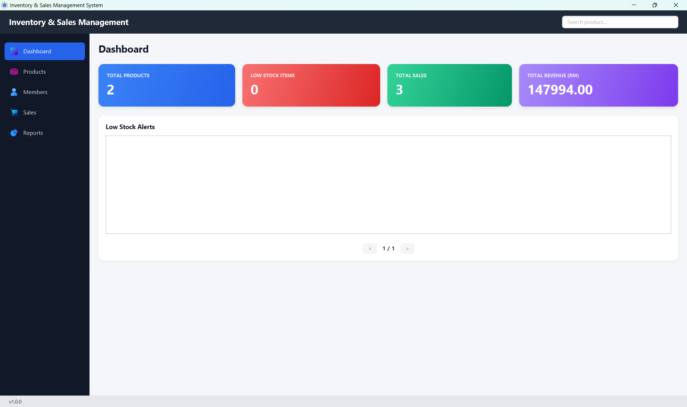
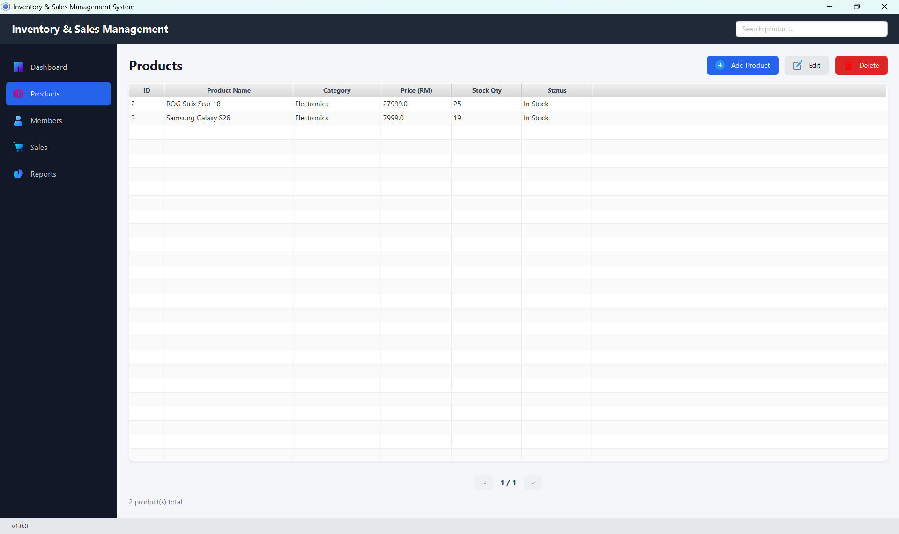
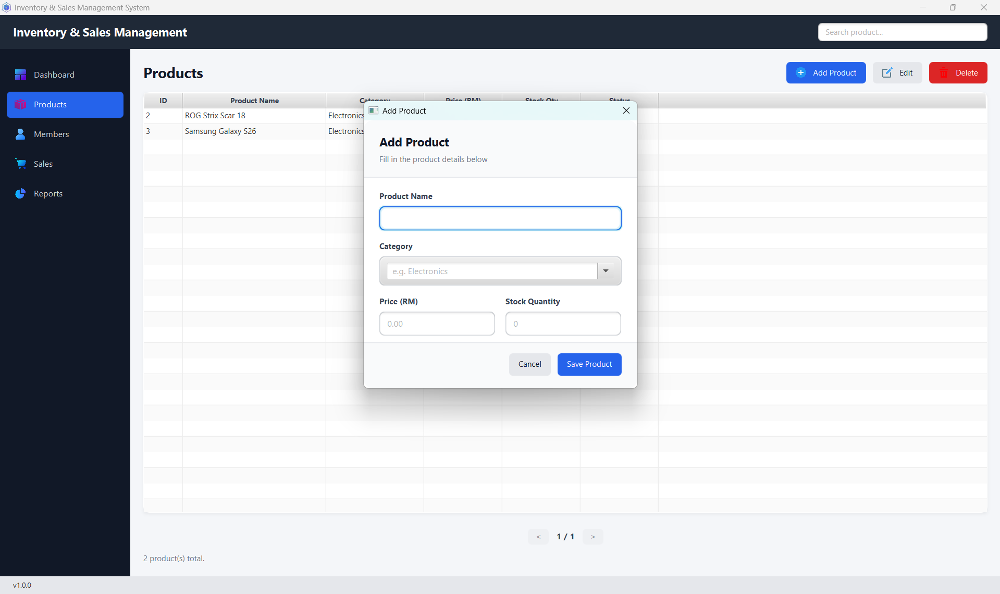
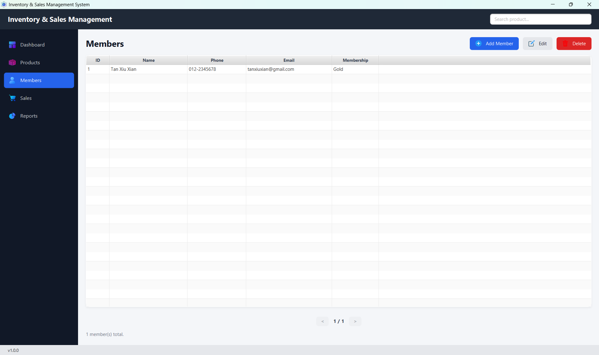
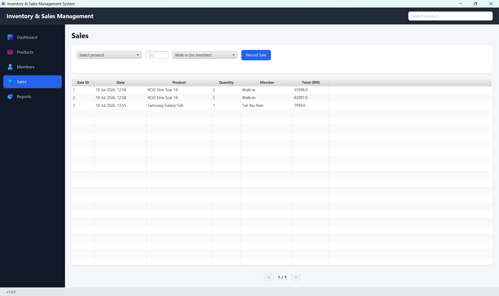
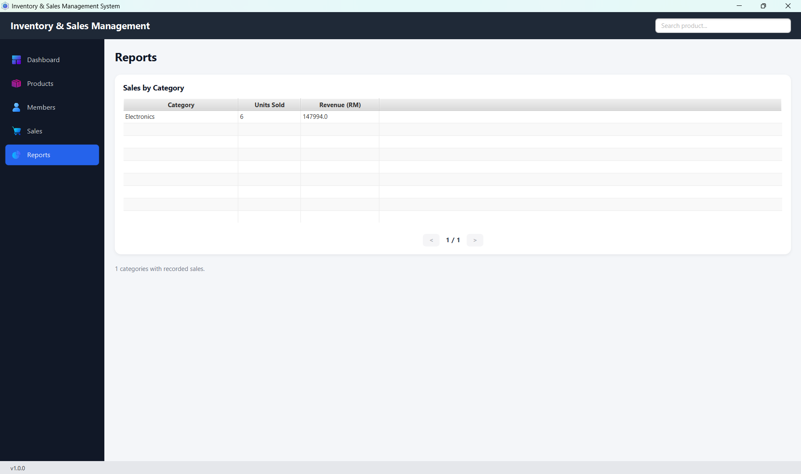

# InventoryPOS — Inventory & Sales Management System

A desktop Inventory & Sales Management System built with **JavaFX** (UI) and **Spring Boot** (dependency injection, Spring Data JPA, transactions), backed by **MySQL**. Built as a personal portfolio project alongside TechShop Leap (a PHP e-commerce web app), to demonstrate a proper layered Java/Spring backend architecture on a similar retail domain.

---

## Screenshots

> _Add your own screenshots below — run the app, take a screenshot of each page (`Win + Shift + S` on Windows), save them into the `screenshots/` folder using the filenames below, then they'll display automatically here on GitHub._

**Dashboard**


**Products**


**Add/Edit Product Dialog**


**Members**


**Sales**


**Reports**


---

## Features

- **Product management** — full CRUD with category, price, and stock quantity tracking, with a low-stock status indicator
- **Member management** — customer records with membership tiers (Standard / Silver / Gold)
- **Sales recording** — select a product + quantity (+ optional member), automatically deducts stock in a single transaction
- **Dashboard** — live stats (total products, low-stock count, total sales, total revenue) plus a low-stock alert list
- **Reports** — sales breakdown by product category (units sold, revenue)
- **Pagination** — Products / Sales / Reports show 30 records per page, Dashboard's low-stock list shows 15 per page
- **Search** — live product name filtering from the top bar
- **Update checker** — checks a hosted `version.json` on startup and prompts the user if a newer release is available
- **Packaged as a native Windows installer** (`.exe`) via `jpackage`, no separate Java install needed for end users

---

## Tech Stack

| Layer | Technology |
|---|---|
| UI | JavaFX 21 (FXML + CSS) |
| Backend / DI | Spring Boot 3.3 (IoC container, no web server) |
| Data access | Spring Data JPA + Hibernate |
| Database | MySQL |
| Build | Maven |
| Packaging | `jpackage` (JDK 17+) + WiX Toolset 3.11 (Windows installer) |

### Architecture notes

- **IoC / Dependency Injection**: Spring Boot's `ApplicationContext` is started in `MainApp.init()` before the JavaFX UI loads. `FXMLLoader.setControllerFactory(springContext::getBean)` tells JavaFX to fetch controllers from Spring instead of `new`-ing them, so `@Autowired` works inside JavaFX controllers.
- **AOP**: `@Transactional` on `SaleService.recordSale()` guarantees the stock deduction and sale record either both succeed or both roll back together.
- **Spring Data JPA**: Repositories (`ProductRepository`, `MemberRepository`, `SaleRepository`) are plain interfaces — Spring generates the SQL implementation at runtime.
- **View switching**: `MainController` acts as an app "shell" — the sidebar and top bar stay fixed, and each page (Dashboard, Products, Members, Sales, Reports) is its own FXML + `@Component` controller, swapped into a `StackPane`.

---

## Prerequisites

To **run the app from source** (e.g. in IntelliJ):
- JDK 17+ ([Oracle JDK](https://www.oracle.com/java/technologies/downloads/) or any JDK 17 distribution)
- MySQL running locally (e.g. via [WAMP](https://www.wampserver.com/en/) or a standalone MySQL install)
- Apache Maven ([maven.apache.org/download.cgi](https://maven.apache.org/download.cgi)) — or use IntelliJ's bundled Maven via the Maven tool window

To **build the `.exe` installer yourself**:
- Everything above, plus:
- [WiX Toolset 3.11](https://github.com/wixtoolset/wix3/releases) (Windows only — required by `jpackage --type exe`)

---

## Setup & Run (from source)

1. Clone the repo:
   ```
   git clone https://github.com/CJY333555/Inventory-and-Sales-Management-Application.git
   cd Inventory-and-Sales-Management-Application
   ```
2. Update `src/main/resources/application.properties` with your local MySQL credentials.
3. Open the folder in IntelliJ as a Maven project (or run from terminal).
4. Run via Maven tool window → `Plugins → javafx → javafx:run`, or from terminal:
   ```
   mvn javafx:run
   ```
   The database (`inventory_pos_db`) and tables are created automatically on first run.

---

## Building the Windows Installer (.exe)

```
mvn clean package
```
This produces a fat JAR at `target\inventorypos.jar` (bundles Spring Boot, JavaFX, Hibernate, MySQL driver).

Then, with WiX Toolset 3.11 installed:
```
jpackage --type exe --input target --name InventoryPOS --main-jar inventorypos.jar --main-class com.techshop.inventorypos.MainApp --icon src\main\resources\images\app-icon.ico --win-shortcut --win-menu --win-dir-chooser --app-version 1.0.0 --vendor "TechShop"
```
This creates `InventoryPOS-1.0.0.exe` in the project root, ready to distribute.

> **Note:** the installer bundles the Java runtime, so end users don't need Java installed. It does **not** bundle MySQL — a MySQL server must be running locally (e.g. via WAMP) for the app to connect.

---

## Project Structure

```
src/main/java/com/techshop/inventorypos/
├── MainApp.java                 # JavaFX entry point - bootstraps Spring, loads main.fxml
├── InventoryPosApplication.java # Spring Boot config (IoC container, no web server)
├── entity/                      # JPA entities: Product, Member, Sale, SaleItem
├── repository/                  # Spring Data JPA repositories
├── service/                     # Business logic layer (@Transactional where needed)
├── controller/
│   ├── MainController.java      # App shell - sidebar nav, view switching
│   └── views/                   # One controller per page (Dashboard, Products, Members, Sales, Reports)
├── dialog/                      # Add/Edit modal controllers (Product, Member)
└── util/                        # PaginationBar, DialogHelper, UpdateChecker, AppVersion

src/main/resources/
├── fxml/                        # Layout files (main shell + per-page views + dialogs)
├── css/style.css                # App-wide styling
└── images/                      # Icons (add your own .png files - see images/README.txt)
```

---

## Releases

Pre-built Windows installers are available under [Releases](../../releases).

---

## Related Project

[TechShop Leap](#) — a PHP/MySQL e-commerce web app built for a university group assignment, covering a similar retail domain (products, cart, orders, reviews) using a vanilla PHP + WAMP stack.

---

## License

MIT — see [LICENSE](LICENSE) if added.
